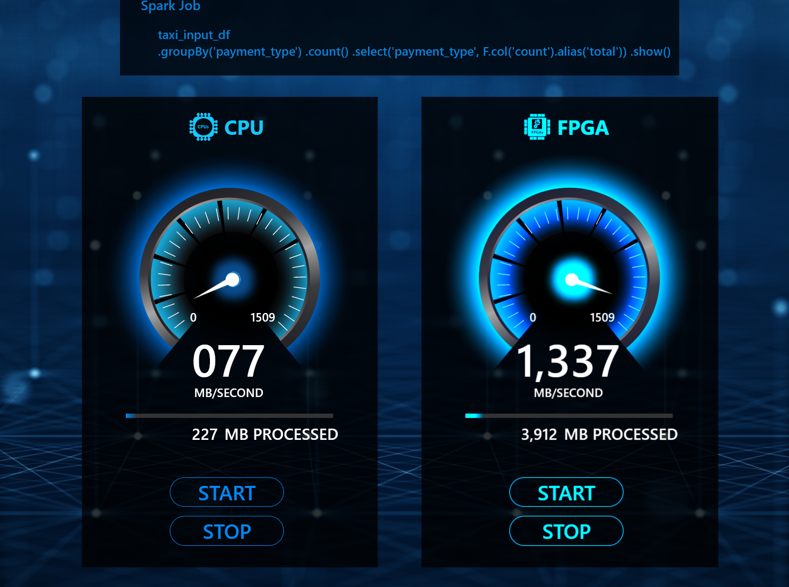

# Asessing CPU vs FPGA Performance Using Spark

We benchmark performance of a simple query using [NYC Taxi Dataset](https://www1.nyc.gov/site/tlc/about/tlc-trip-record-data.page).



## Downloading and Normalizing Data

We use a subset of the Yellow Trip Data consisting of files with 18 columns. We further normalize the data in these files to conform to the schema published on the NYC Taxi Dataset site for [Yellow Taxi trips](https://www1.nyc.gov/assets/tlc/downloads/pdf/data_dictionary_trip_records_yellow.pdf).

To download the data locally:

1. Clone this repo
1. Clone [nyc-taxi-data](https://github.com/toddwschneider/nyc-taxi-data) git repo
1. Edit `download_raw_data.sh` in the root of `nyc-taxi-data` repo replacing the default `setup_files/raw_data_urls.txt` with `<this_repo>/dataset/yellow_taxi_files.csv`
1. Run `./download_raw_data.sh` to download the dataset.
1. Normalize the downloaded dataset by going through the `Notebooks/Standardize Schema.ipynb` in this repo. The `clean_schema` function is what does normalization.

Our dataset is 100 GB in size split into 82 files.

## Collecting Performance Data

We use local Spark configured with `local[*]` (default) and structured streaming to measure and aggregate performance on our dataset. Each streaming batch consists of a single CSV file. The profiled query is:

```sql
select payment_type, count(*) as total from nyctaxidata group by payment_type
```

As configured above, all local CPU cores are utilized for the query.

### CPU

1. [Install Apache Spark](https://www.apache.org/dyn/closer.lua/spark/spark-2.4.5/spark-2.4.5-bin-hadoop2.7.tgz).
1. In `<repo_root>/benchmarking/queries/benchmark_taxi.scala`, modify the following values as appropriate:

```scala
val rootPath = s"~/data/taxi_data_cleaned_18_standard" //root of the dataset
val magentaOutDir = s"~/data/queries_e8/$queryName/processed/results" // query results
val checkpointLoc = s"~/data/queries_e8/$queryName/checkpoint" // checkpoint files
val logDir = s"~/data/queries_e8/$queryName/monitor/results" // profiling results
```
3. Launch spark-shell with enough memory to stream the data:

From the root of this repo:

```sh
$ cd benchmarking/queries
$ spark-shell --driver-memory 50G
```

4. Load the relevant file and launch Spark processing

```scala
scala> :load benchmark_taxi.scala
scala> Benchmark.main(1)
```

Benchmarking results will be placed in the directories prefixed with `logDir`, so in the example above these will be: 
 ```
 ~/data/queries_e8/q1/monitor/results_0
 ~/data/queries_e8/q1/monitor/results_1
 ~/data/queries_e8/q1/monitor/results_2
 etc
 ```
5. Collect the results:
```sh
$ cat ~/data/queries_e8/q1/monitor/results_*/*.csv > taxi_q1_profile.csv
```

### FPGA

Provisioning an NP-10 machine in Azure and going through the above steps should yield the benchmarks for FPGA. For the demo we used a custom "one-off" implementation of this query to assess FPGA performance.

## Web UI

See this [README](demo/README.md) for instruction on how to visualize performance data in Web UI. Here is the [finished app](https://speeddemo.z5.web.core.windows.net/)