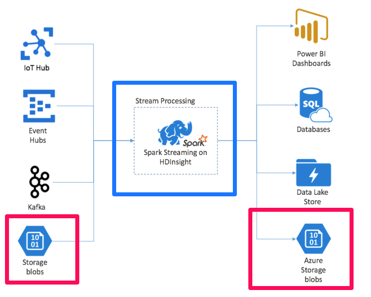
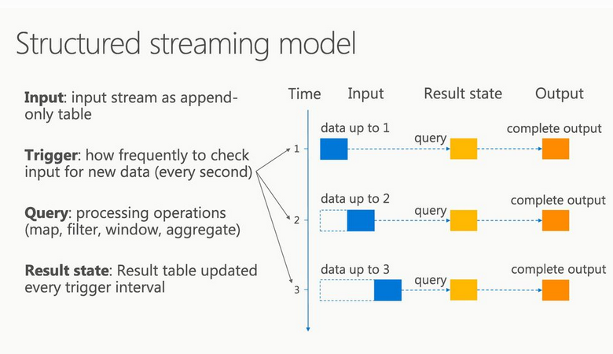

# Taxi Dataset Demo Architecture

## Overview

We select a ~230 Gb subset of the [NYC Taxi dataset](https://github.com/toddwschneider/nyc-taxi-data) that covers Yellow Cab records for 2009 - 2019. The data is split into 130 CSV files and deposited in Azure Data Lake Storage Gen2. 

We then use Spark to demonstrate performance improvements resulting from use of Pipedream/FPGA as the backend compared to CPU.

## Running on the cluster

Spark abstracts the distributed computation paradigm. We setup the HDInsight Spark cluster in Azure. The dataflow is shown in the diagram below.

The ruby squares show data stores pre- and post-processing. The cluster itself in the blue square is expanded below.

Driver (head) and workers are all instances in the HDFS under Yarn management in HDInsight. The resource manager is responsible for brokering data between external and cluster storage.

## Running locally

Spark runs locally as an application inside the JVM.

## Demo flow

Two sets of machines, local or cluster, used to showcase FPGA vs CPU perfromance

### Prerequisites

Download the dataset to the accessible store

### Scenario

We trigger Spark jobs for CPU and FPGA based machines and show performance gains in a compelling visualization

### Demo on the cluster: structured streaming

* Data is uploaded to Blob Storage (Data Lake Storage Gen2) all 233 Gb split into CSV files and the Spark streaming model is used to continuously write out query results:

* Processing is triggered every second creating a stream of CSV files that are then queried and query results are deposited into Blob Storage
* An Azure Function monitors the output storage and when new files arrive notifies the web-based visualization app

#### Pros:

* Scenario reflects real life

#### Cons:

* Network latency may consume performance gained from using FPGA

### Demo locally

* A single VM with Spark installation in Azure
* Data is loaded onto the local SSD drive
* Logs are written as query results become available
* The logs are served to the visualization app

#### Pros

* No network dependencies, FPGA performance clearly visible

#### Cons

* Scenario not reflecting real life

